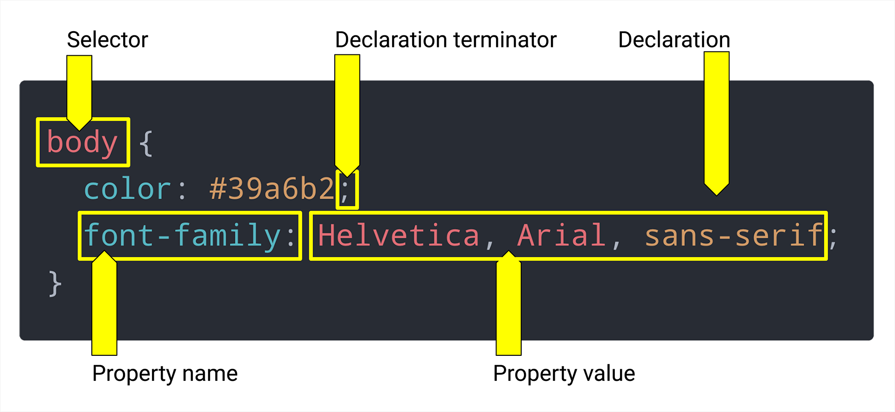

### Git Bash:

**command-line interface (CLI)** or **terminal** -> Git Bash

`pwd` command stands for "print working directory." **print** refers to displaying something to the screen

`ls`. This command lists the files and folders within the current directory. If `pwd` is like asking, "Where am I?" then `ls` is like asking, "What's here?"

`cd <directory-name>` command allows you to move in and out of directories.

`cd ..` took us back a level (or "up" a directory).

`mkdir <directory-name>` command creates a new folder.  `mkdir` `<NameTheFolder>`

`rmdir` `<NameTheFolder>` command removes a folder.

`clear` clears everything in the CLI screen

`touch <file-name>` command creates a new file.

`rm` `<NameTheFile>` command removes a file.

`rm -rf` `<NameTheFolder>` command removes a folder.

`rm -R` `<NameTheFolder>` command removes a folder and its contents.

`mv` `<NameTheFile>` `<NameTheNewFile>` command moves a file.

`mv` `<NameTheFolder>` `<NameTheNewFolder>` command moves a folder.

`cp` `<NameTheFile>` `<NameTheNewFile>` command copies a file.

`cp` `<NameTheFolder>` `<NameTheNewFolder>` command copies a folder.

`cp` command copies files and directories.

`cp` `<source>` command copies files and directories.

`cp` `<source>` `<destination>` command copies files and directories.

`cp` `<source>` `<destination>` `<source>` command copies files and directories.

`cp` `<source>` `<destination>` `<source>` `<destination>` command copies files and directories.

`cat` `<NameTheFile>` command prints the contents of a file to the screen.

`echo` `<NameTheString>` command prints a string to the screen.

`echo` `<NameTheString>` `>` `<NameTheFile>` command prints a string to a file.

`echo` `<NameTheString>` `>>` `<NameTheFile>` command appends a string to a file.

`>` redirects the output of a command to a file. `>` `<NameTheFile>`

`>>` appends the output of a command to a file. `>>` `<NameTheFile>`

`<` redirects the input of a command from a file. `<` `<NameTheFile>`

`|` redirects the output of a command to the input of another command. `|` `<NameTheCommand>`

`>` and `>>` are called **redirection operators**. They redirect the output of a command to a file.

`<` is called a **redirection operator**. It redirects the input of a command from a file.

`|` is called a **pipe**. It redirects the output of a command to the input of another command.

`git init` command creates a new Git repository.

`git init` `<NameTheRepository>` command creates a new Git repository with the specified name.

`git status` command shows the status of changes as untracked, modified, or staged.

`git add` command stages files, preparing them to be committed to the repository.

`git commit` command permanently stores file changes in the repository.

`git log` command shows a list of all previous commits.

`git diff` command shows the difference between the working directory and the staging area. command shows the difference between the staging area and the most recent commit. command shows the difference between the working directory and the most recent commit.

`git checkout` command restores a file to a previous version.

`git reset` command un-stages files that were previously staged. command undoes commits and erases the changes made in them. command erases all commits after the specified commit, preserving changes locally.

`git remote` command manages set of tracked repositories. command shows all remote URLs next to their corresponding short names. command adds a new remote repository. command renames a remote. command removes a remote repository.

`git push` command sends committed changes of master branch to your remote repository. command sends commits of any branch to your remote repository. command sends all branches to your remote repository.

`git pull` command fetches and merges changes on the remote server to your working directory.

`git clone` command makes a copy of an existing Git repository from a particular URL.

`git branch` command lists all the branches in your repository. command creates a new branch. command renames a branch. command deletes the specified branch.

`git merge` command merges the specified branch’s history into the current branch.

`git stash` command temporarily stores all the modified tracked files.

`git tag` command lists all the tags in your repository. command creates a new lightweight tag. command creates an annotated tag. command deletes the specified tag.

`git config` command gets and sets repository or global options. command gets and sets the author name to be used for all commits by the current user. command gets and sets the author email to be used for all commits by the current user.

`git help` command shows a list of all the available Git commands. command shows documentation for a particular command.

`git show` command shows the metadata and content changes of the specified commit.

`git stash` command temporarily stores all the modified tracked files.

`git stash list` command lists all stashed changesets.

`git stash apply` command restores the most recently stashed files.

`git stash drop` command discards the most recently stashed changeset.

`git stash pop` command restores the most recently stashed files and discards the changeset from the stash list.

`git stash clear` command discards all stashed changesets.

`git stash branch` command creates and checks out a new branch named `<branch>` and restores the most recently stashed files on it.

`git stash save` command stashes the modified tracked files in preparation for a clean working directory.

`git stash save` `<message>` command stashes the modified tracked files in preparation for a clean working directory.

`git stash show` command shows the metadata and content changes of the specified stashed changeset.

`git stash show` `-p` command shows the metadata and content changes of the specified stashed changeset.

`git stash show` `-p` `<stash>` command shows the metadata and content changes of the specified stashed changeset.

`git stash show` `<stash>` command shows the metadata and content changes of the specified stashed changeset.

`git stash apply` `<stash>` command restores the specified stashed changeset.

`git stash drop` `<stash>` command discards the specified stashed changeset.

`git stash branch` `<branch>` `<stash>` command creates and checks out a new branch named `<branch>` and restores the specified stashed changeset on it.

`git stash push` command stashes the modified tracked files in preparation for a clean working directory.

`git stash push` `-m` `<message>` command stashes the modified tracked files in preparation for a clean working directory.

`git stash push` `-m` `<message>` `<pathspec>` command stashes the modified tracked files in preparation for a clean working directory.

`git stash push` `<pathspec>` command stashes the modified tracked files in preparation for a clean working directory.

`git stash create` command stashes the modified tracked files in preparation for a clean working directory.

`git stash create` `<message>` command stashes the modified tracked files in preparation for a clean working directory.

`git stash create` `<message>` `<pathspec>` command stashes the modified tracked files in preparation for a clean working directory.

`git stash create` `<pathspec>` command stashes the modified tracked files in preparation for a clean working directory.

`git stash store` command stashes the modified tracked files in preparation for a clean working directory.

`git stash store` `-m` `<message>` command stashes the modified tracked files in preparation for a clean working directory.

`git stash store` `-m` `<message>` `<commit>` command stashes the modified tracked files in preparation for a clean working directory.

`git stash store` `<commit>` command stashes the modified tracked files in preparation for a clean working directory.

`git stash store` `-m` `<message>` `<tree>` command stashes the modified tracked files in preparation for a clean working directory.

`git stash store` `<tree>` command stashes the modified tracked files in preparation for a clean working directory.

`git stash store` `-m` `<message>` `<parent>` command stashes the modified tracked files in preparation for a clean working directory.

`git stash store` `<parent>` command stashes the modified tracked files in preparation for a clean working directory.

`git stash store` `-m` `<message>` `<tree>` `<parent>` command stashes the modified tracked files in preparation for a clean working directory.

`git stash store` `<tree>` `<parent>` command stashes the modified tracked files in preparation for a clean working directory.

`git stash store` `-m` `<message>` `<tree>` `<parent>` `<pathspec>` command stashes the modified tracked files in preparation for a clean working directory.

`git stash store` `<tree>` `<parent>` `<pathspec>` command stashes the modified tracked files in preparation for a clean working directory.

`git stash store` `-m` `<message>` `<tree>` `<parent>` `<author>` command stashes the modified tracked files in preparation for a clean working directory.

`git stash store` `<tree>` `<parent>` `<author>` command stashes the modified tracked files in preparation for a clean working directory.

`git stash store` `-m` `<message>` `<tree>` `<parent>` `<author>` `<committer>` command stashes the modified tracked files in preparation for a clean working directory.

`git commit --amend` command amends the most recent commit.

`git commit --amend` `-m` `<message>` command amends the most recent commit.

`git commit --amend` `-m` `<message>` `<file>` command amends the most recent commit.

`git commit --amend` `<file>` command amends the most recent commit.

`git commit --amend` `-m` `<message>` `<file>` `<file>` command amends the most recent commit.

`git commit --amend` `<file>` `<file>` command amends the most recent commit.

`git commit --amend` `-m` `<message>` `<file>` `<file>` `<file>` command amends the most recent commit.

`git commit -m "Initial commit"` command commits all staged changes.

`git commit -m "Initial commit"` `<file>` command commits all staged changes.

`git commit -m "Initial commit"` `<file>` `<file>` command commits all staged changes.

`git commit -m "Initial commit"` `<file>` `<file>` `<file>` command commits all staged changes.

`explorer .` command opens the current directory in Windows Explorer.

`explorer` `<path>` command opens the specified directory in Windows Explorer.

`explorer` `<path>` `<path>` command opens the specified directory in Windows Explorer.

`code .` command opens the current directory in Visual Studio Code.

`code` `<path>` command opens the specified directory in Visual Studio Code.

`echo %PATH%` command displays the current value of the PATH environment variable.

`echo` `<string>` command displays the specified string.

`@echo off` command disables command echoing.

`@echo on` command enables command echoing.

`q` command quits the current command prompt.

`exit` command quits the current command prompt.

---

### Semantic HTML

HTML (Hypertext Markup Language)

`<!DOCTYPE html>`  Tells the browser to interpret as a HTML documen
`<html lang="en">` Represents the root of an HTML document and tells the browser that the language of the document is English
`<head>`  Start of the head element tag. Contains information about the document for the browser, but not the content mportant to include because it specifies the range of characters (letters, numbers, symbols, etc.) that can be used.
`<meta charset="UTF-8" />` Tells the browser to use the UTF-8 character set. charset' meta element should be the first thing in '`<head>`'. UTF-8 accommodates just about any character, from foreign language symbols to emojis.
`<meta name="viewport" content="width=device-width, initial-scale=1.0" />`  Tells the browser to use the device's width as the width of the page, and to scale the page to fit the device's width
`<title>Run Buddy</title>`  The title of the document, which is displayed in the browser's tab
`</head>`  Ending of the head element tag
`<body>`  Contains and/or displays the content of the document

# `<h1>RUN BUDDY</h1>`  "level 1" heading element

## `<h2>RUN BUDDY</h2>`  "level 2" heading element

### `<h3>RUN BUDDY</h3>`  "level 3" heading element

#### `<h4>RUN BUDDY</h4>`  "level 4" heading element

##### `<h5>RUN BUDDY</h5>`  "level 5" heading element

###### `<h6>RUN BUDDY</h6>`  "level 6" heading element

What We Do What You Do Your Trainers Reach Out  text in the body element
`</body>`  Ending of the body element tag
`</html>`  Ending of the html element tag


`<div>` elements here, which are like containers, to hold relevant information together. stands for "content division."

`<section>` element tag represents a generic standalone section of a document, which doesn't have a more specific semantic element to represent it. Sections should always have a heading, with very few exceptions.

`<nav>` element tag represents a section of a page whose purpose is to provide navigation links, either within the current document or to other documents. Common examples of navigation sections are menus, tables of contents, and indexes.

`<header>` element tag represents introductory content, typically a group of introductory or navigational aids. It may contain some heading elements but also a logo, a search form, an author name, and other elements.

`<footer>` element tag represents a footer for its nearest sectioning content or sectioning root element. A footer typically contains information about the author of the section, copyright data, contact information, links to related documents, and so on.

`` element tag represents an image in the document. It has two required attributes: src, which specifies the URL of the image, and alt, which provides a text description of the image.

`<a>` element tag creates a hyperlink to web pages, files, email addresses, locations in the same page, or anything else a URL can address. The content of the element is the text that will be displayed for the link. This term was coined in the early 1960s, its definition has expanded to include other types of media as well (such as images and videos).

`<ul>` element tag represents an unordered list of items, typically rendered as a bulleted list. Each item in the list is represented by an `<li>` element.

`<ol>` element tag represents an ordered list of items, typically rendered as a numbered list. Each item in the list is represented by an `<li>` element.

`<li>` element tag represents an item in a list. It must be contained in a parent element: an ordered list (`<ol>`) or an unordered list (`<ul>`).


`<p>` element tag represents a paragraph. Paragraphs are usually represented in visual media as blocks of text separated from adjacent blocks by blank lines and/or first-line indentation, but HTML paragraphs can be any structural grouping of related content, such as images or form fields.

Accessibility is the practice of adding HTML elements in a way that allows assistive technology, such as screen readers, to explain the page's content in a meaningful way to those who have a disability such as vision or hearing loss.

SEO, or search engine optimization, is the process of maximizing the number of visits a website receives and how frequently it shows up in search results.

`href=` is an HTML **attribute can be used to give an HTML element a unique identity, create relationships with other elements, and provide design changes using CSS. They give functionality, meaning, and context to HTML elements. Attributes aren't necessary for every element, but some do require them. One of those is the `<a>` element. If we were to omit the `href` attribute in the preceding examples, the links wouldn't work. **

Here are some popular attributes:

* The **`id`** attribute is a unique identifier for an HTML element. The value of this can only be used once per HTML document.
* The **`class`** attribute is another way of identifying an HTML element, but its value is expected to be more general and can be reused across multiple HTML elements on a page.
* The **`title`** attribute—not to be mistaken for the `<title>` element—holds a value that appears as a small pop-up (known as a tool-tip) when the cursor is pointed at an element for a period of time.

(`"/"`) a forward slash—will always represent the path to the topmost directory of an application or project. will be taken to the topmost directory

If you ever need to quickly fill an HTML element with dummy text in VS Code, type the word "lorem" and press Tab. Many other dummy text generators are available online.

## About SVG Files

This is XML, which is like a cousin to HTML. Unlike PNGs or JPGs, which are made up of pixels, SVGs (or Scalable Vector Graphics) are defined as a series of points and lines (the `<path>` elements you see in the XML) that are filled in with color. SVG images can accommodate basically any screen size without losing quality because the graphics will scale. That makes SVGs perfect for things like icons and logos.

`` element is very useful because it can display any image format. We just need to make sure the `src` attribute points to a file that can be found.

Relative paths start from the current directory (for example, `../images/hero-bg.jpg`). Absolute paths are fixed (for example, `/Users/<username>/Desktop/run-buddy/assets/css/style.css`) and should be avoided.

extra attribute we should make sure every image has: the `alt` attribute. The `alt` attribute explains the content and context of images to search engines and assistive technology such as screen readers.

As a developer, you will often have to make a subjective decisions about your project’s HTML and CSS. In these cases, it is important to take time to think about how the image will be used and carefully read the project’s specifications or acceptance criteria for guidance. Many companies also have an in-house style guide that can help inform your choice and make certain your code meets both the client's and users' needs. To learn more about image usage, refer to the [alt attribute guidelines from the W3C **Links to an external site.**](https://www.w3.org/WAI/tutorials/images/).


In Lesson 4, we discussed one way of using `alt` by leaving its value empty. We did this because the image it was associated with isn't important for the overall user experience; it is what's known as a  **decorative image** . In this case, the image does serve as content to the page and is known as a  **simple image** , so we need to give it a more meaningful `alt` value.

Here are some guidelines for `alt` values:

* They must describe the image in less than 140 characters.
* They should convey the content and purpose of the image.
* They should not begin with "image of…" or "graph of…", as screen readers already provide that context.

When a parent HTML element's style is applied to any child element, it is called  **inheritance** .


## The iframe Element

Fortunately, there is a special HTML element called an `<iframe>` that helps us do just this! An  **`<iframe>`** , which means  **inline frame** , nests browsing content and embeds an HTML page into the current page. An `<iframe>` can add rich features to a website, including videos with playback controls, GIFs, and maps. One caveat, however, is that not all websites support this feature.

In this case, the `<iframe>` will contain a map of Run Buddy's address from Google Maps. Let's place the `<iframe>` inside the  **contact container** .

Follow these steps to retrieve an `<iframe>` for the address:

1. Enter your address in the search box on [Google Maps **Links to an external site.**](https://www.google.com/maps).
2. Select the Share icon.
3. Choose the Embed a map tab.
4. Select the COPY HTML link to copy the `<iframe>` element.


`<iframe>`:

* The **`src`** attribute is the most important attribute; without it, nothing will render. The `src` value is a URL path linking to the external website content that will be embedded. This should be familiar because it's the same attribute used in the `` element.
* The **`style`** attribute is an inline style to set no border, for newer browsers.
* The **`allowfullscreen`** attribute offers a link to view the map on a new page in full-screen mode. Some attributes are properties that can be turned on by simply adding the attribute. Notice how `allowfullscreen` doesn't have any value assignment. Another popular attribute that doesn't have a value assignment is `checked` for a `checkbox` input element.


The **`<address>`** element defines the contact information for the author or owner of the document or parent element.

The **`<a href="mailto:info@runbuddy.io">`** element uses the `mailto:` prefix in the anchor tag's `href` attribute to instruct the browser to open the default mail client application upon clicking the link. Then it populates the address field with the email address in the `href` value.

---

# CSS

Cascade Style Sheet

## CSS Syntax

CSS's syntax is fairly simple and can be used in many different ways to achieve an intended presentation or design. Developers use it by listing the HTML element they want to style, then listing a predefined style characteristic (known as a  **property** ) and giving it a value.

Let's look at some CSS syntax, as shown in the following image:



* **Selector** : This is the part that says "let's find this matching HTML element (in this case, the `<body>` element) so we can tell it what it should look like." This is the most basic of selectors, where we select by HTML element name. We can use a CSS selector to be very vague (apply styles to all `<a>` elements) or very specific (apply styles to any `<a>` element that's inside a `<header>` element and ignore any of the others that are not). We'll get into more specific selectors later.
* **Property name** : CSS has an extensive list of possible style properties that it recognizes. All we need to do is list one in between the selector's `{}` brackets and we can now change how that element looks. Examples of popular CSS properties are `color` (to control the text color), `background-image` (to apply a background image to that section), and `font-family` (to change the default font). If we use one that isn't predefined, then the browser will ignore the style.
* **Property value** : This is where we get to provide the desired look to the element. Like properties, CSS has a specific set of possible variations for values that it will understand. In the preceding image, we provide a value of `#39a6b2` to the `color` property (more on this value's meaning soon), which is a value that represents a color and a valid value for any CSS property that deals with colors. Here's another example: if we were to say `font-size: 3meters`, it wouldn't be understood and thus wouldn't be applied. But if we were to say `font-size: 24px`, the font's size would be set to 24 pixels because that's a value CSS can understand.
* **Declaration** : A `property: property-value` pairing like we see with `font-family: Helvetica` is what's known as a declaration.
* **Declaration terminator** : To apply multiple styles to an element (known as a  **declaration block** ), we need some way to tell the language "this declaration is finished; make a new one." CSS knows a declaration is complete when it sees a semicolon (`;`) at the end. Accidental omission of the terminator will result in CSS thinking everything after it is still part of that first declaration, so it is very important to terminate your declarations.
* **CSS rule** : The entire block shown in the preceding image is what's known as a  **CSS rule** . It is the combination of the selector and all of the declarations.

writing CSS with the file extension `.css`

connect it to the HTML file using a specific HTML element `<link>`, which goes in between the opening and closing `<head>` tags and looks something like this (depending on your filename):

`style` attribute with the styles you want to apply directly to the HTML tag element. This is known as **inline styling** because it is directly included in the element it's styling, as in the following code example:

a `<style>` element with all CSS style rules contained within it. The `<style>` element typically goes in the `<head>` of the document.

This reinforces a concept called  **separation of concerns** , which means that it's better to keep code that serves different purposes in separate files so that it's easier to maintain.

provided a value to an `href` that points to another file in the directory. This is known as **relative pathing**

`rel`, is providing information on the nature of the relationship of the linked document—the one specified with the href—to the HTML. In this case and most of the time, we'll use `rel="stylesheet"`

ther option would be to put a fixed path (also known as an  **absolute path** ) from the host computer's directory structure, which would look something like this:

```html
<link rel="stylesheet" href="/Users/<username>/Desktop/run-buddy/assets/css/style.css" />
```

potential problem here? This path is very specific to someone's personal computer—it even has a username in it. If we were to put this code into production or share it with a teammate, the project's code would then live on a different computer entirely. The path in the example most likely does not exist on that computer, meaning any reference to it would break and the page wouldn't load correctly.

The best solution for this is to use  **relative pathing** . With relative pathing, when we push up the entire folder structure for the project all at once, the paths don't lose context as to where they are.

Here are a few ways that padding can be applied:

```css
 /* Applies 20px to every side (top, right, bottom, left) */
 header {
   padding: 20px;
 }

 /* Applies 20px to the top and bottom, then 35px to the left and right */
 header {
   padding: 20px 35px;
 }

 /* Applies 10px to the top, 15px to the right, 20px to the bottom, 25px to the left (in that specific clockwise order) */
 header {
   padding: 10px 15px 20px 25px;
 }

 /* Explicitly list the side it should be applied to*/
 header {
   padding-top: 10px;
   padding-right: 15px;
   padding-bottom: 20px;
   padding-left: 25px;
 }
```

The **CSS Box Model** is a visual display of the properties in the CSS box that includes the content, padding, border, and margins, which are all built around each other like layers in an onion. Some of the styles of each layer—like border thickness, style, and color—can be manipulated using CSS.


break down the CSS Box Model:

* **Content** is the innermost box inside the CSS box that will contain text as well as any nested elements. The content box size is determined by the height and width.
* **Padding** refers to the inside margin within the CSS box. Each of the four sides of the padding size can be specified.
* **Border** sits on the outside edge of the padding and the inside edge of the margin. This layer's sides, size, and styles can be specified, similarly to the padding and margin. Such as border-bottom or border-style or even border-top-color. This property also needs a weight of the line, style, and color to render.
* **Margin** behaves a lot like `padding`, except whereas `padding` creates space *inside* the box, `margin` creates space *outside* the box and pushes any other HTML elements before and after it away. It also behaves like `padding` in the way its values are provided (top, right, bottom, left).

The **cascade** is a set of rules CSS follows when determining the order of importance when it comes to applying styles. Say, for instance, we want to make multiple `<a>` elements in the `<header>` yellow, but we want to make the `<a>` element in the `<footer>` blue. This can be achieved by being more specific in the selection of elements and saying "let's select all `<a>` that are in `<header>` and do this with them," meaning we will only focus on elements inside another element.

The cascade considers the following three factors:

1. **Importance** : When you add `!important` to the end of a property declaration, it will override any conflicting style declarations for that element. This isn't recommended because overriding the default "cascading" behavior of CSS will make your site harder to maintain.
2. **Specificity** : CSS weighs the importance of different types of selectors by how specific they are. If we were to apply a style by selecting `h1`, it will apply to all `<h1>` elements. But if we were to then apply a style by selecting `header h1`, it will ignore conflicting property declarations in the `h1` definition and apply `header h1` instead because it is a more specific selection.
3. **Source Order** : There's nothing to stop us from accidentally selecting and defining styles to the same element more than once, but CSS is read top-down. This means that if we select `h1` and give it a color of red on line 1, then select it again and give it a color of blue on line 4, the `<h1>` element will be blue because that was defined later.

CSS styles are also applied through something known as  **inheritance** , which means that if a style isn't explicitly defined for a child element, it will use the style being applied to the parent element.

**`text-decoration`** property applies `underline`, `strikethrough`, or `overline` styles to text default, the value is `none`

The **`float`** property takes an element that wants to occupy 100% of its parent's width by default (known in CSS as a  **block element** ) and pushes everything that follows it below it, allowing other elements to come alongside of it or wrap around it (known in CSS as  **inline elements** ).

We can use the `float` property when we have HTML elements that would look better side by side, which allows us to use the horizontal space in a more meaningful way. Other CSS properties allow us to turn block elements into inline elements, but using `float` in this case made more sense because we needed to turn this element into an `<inline>` element and move it to the right. The `float` property let's us do both at once.

**block-level element** . Popular elements that have a default block styling are the `<h1>`–`<h6>` elements, `<div>`, `section`, `<nav>`, `<header>`, `<footer>`, and `<li>`.

**inline element** , which only occupies the space it needs to occupy and does not demand 100% width. These are used to allow elements to appear to the left or right of them. The most popular inline element is the `<a>` element.

**Block elements** occupy 100% of the width of their parent, regardless of content size. **Inline elements** only occupy as much space as their content needs, which means that multiple inline elements can sit next to each other.

CSS allows us to override these elements' default layout definitions through a few different ways, but the most on-the-nose one is to apply a `display` property to that element. For example, `display: block` forces an element to occupy 100% of the width of its parent. On the other hand, `display: inline` makes an element only occupy the space it needs and allows other elements to flow "in line" with it horizontally.

The asterisk `*` we used here is used quite often in programming. It is typically called a wildcard, but in CSS it is known as a  **universal selector** . This is essentially a catch-all selector that says, "I won't match one thing—I'll match everything!"

**`<br />`** : We used the break element (`<br/>`) to create a line break

**`line-height`** property assigns how much vertical space should be between lines of text content. The value (1.5) means we want the spacing to be 1.5 times the size of the font

**`text-align`** property lets us align the text to the left, right, center, or justified. By default, it is left-aligned.

**`&copy;`** : In the preceding code, `&copy;` precedes the Run Buddy copyright notice; it creates the little copyright symbol. This is called an  **HTML entity** , a special code that starts with an ampersand (`&`) and can be used to create symbols.
In case you haven't noticed, every HTML element is surrounded by a less than (`<`) and greater than (`>`) symbol. So what happens if we need to use a greater than sign as content and not as HTML syntax? The solution is to use the HTML entity `&gt;` which creates a `>`.

`box-sizing` property determines how to calculate the `width` and `height` of each element. There are two possible values for the `box-sizing` property: `content-size` and `border-box`.

* The **`content-size`** value is the default, and calculates the height and width of the element by only counting the `content` box of the CSS Box Model. This means that the `border` and `padding` must be calculated separately and added to the width and height to determine the size of the element.
* The **`border-box`** value calculates the height and width of the element by including the `border` and `padding` additions to the `content` box.


sign-up form is a  **call to action** , or  **CTA** . The main purpose of a CTA is to encourage users via a story, advertisement, or dazzling piece of content to do something. CTAs play a vital role in converting a visitor into a sales lead—that's why we want it at the top of the page!

**Text fields** are where the user will enter their name and contact information.


The `<label>` text not only offers a visual directive of what to enter but also programmatically links to the associated `<input>`. When a user with a visual impairment uses a screen reader, the label will be read out loud when they focus on the input field. Labels also make it easier to fill out forms on mobile devices; clicking on the label will target the focus to the associated input field, which can be hard to do manually on a small screen.

Let's break down the attributes in the `<label>` and `<input>` elements:

* The **`for`** attribute in the `<label>` element programmatically links to the `id` attribute in the `<input>` element.
* The **`type`** attribute relates to the type of input element we're using. Here, we want a text field, which is also the default value.
* The **`placeholder`** attribute offers a hint or label within the text field, but will not be submitted if this field if left blank.
* The **`name`** attribute identifies the element so the response can be referenced after the form is submitted.


**Dot notation** is the "." that precedes the class `hero` to indicate to the browser that we're using a class as the CSS selector.

The **`background-image`** property uses the CSS function `url()` to link a resource such as an image, web font, or GIF. Here we're using a relative URL path to select a background image

**`height`** property fixed at 600px gives an exact size of the section, which is important in this context to allow room for the sign-up form.

The **`background-size`** property can set the size of the background image to its original size or make it stretched, repeated, or constrained to fit the available space. In this case, we'll set it to `cover` to shrink the image so that parts of it won't get clipped. Other options allow repeated images for a tiled look, similar to how background image displays are configured for your computer's background desktop image.

The **`background-color`** property sets the background color to the element selected. VS Code allows typing in the names of colors as well as the hex code.

`position` property is an important CSS property that defines how an element is positioned on the webpage.

Here are some of the property's values and how they affect the relationship of the element to the surrounding elements:

A value of **`static`** is the default value and maintains the order of the natural flow of the elements on the page (i.e., the order created in the HTML). `static` positioning isn't affected by the `top`, `bottom`, `left`, and `right` properties. Currently, the sign-up container is in this position.

A value of **`relative`** positioning uses the `top` and `bottom` properties to vertically offset and the `left` and `right` properties to horizontally offset the element from the `static` position.

A value of **`absolute`** positioning removes the element from the natural flow of the page elements and uses the `top`, `bottom`, `left`, and `right` properties to offset relative to the element's parent, or containing, element's margins.

A value of **`fixed`** positioning removes the element from the natural flow of the page elements and positions it relative to the viewport or browser window so that it isn't affected by scrolling. The `fixed` position value uses the `top`, `bottom`, `left` and `right` properties to offset the element from the viewport's margins.


This is shorthand for setting a top and bottom margin of zero and a left and right margin of `auto`. But what does `auto` mean? Essentially, it tells the browser to calculate the margins for us. When the browser is asked to do this on both sides of an element, it will do its best to make them even, thus pushing the element into the center.

With Chrome DevTools, we can inspect the element's margins before `auto` is applied and after. In the following image, the orange boxes indicate the margins:


The `overflow` property told the trainer's `<article>` element that it does in fact have content inside it, and that it needs to look for it and account for those two floated HTML elements' sizes. This is known as providing **block formatting context** to the element

A **type selector** is a CSS selector (in this case, `iframe`) that selects every HTML element of that type. This is a potentially dangerous choice due to possible side effects (unless a global rule is needed). By using the class as the CSS selector, also called a  **class selector** , we can safely target the `<iframe>` that's a descendant or child of the element with this class.

What's the purpose of the `vertical-align` property, and what problem does it solve here? Because the content of this `<div>` naturally rests at the bottom of the container, we need the `vertical-align` property to lift this content up to the top. In conjunction with the `text-align` property, this allows the contact information to begin at the top of the `<div>` and start aligned from the left for an easy-to-read layout.
